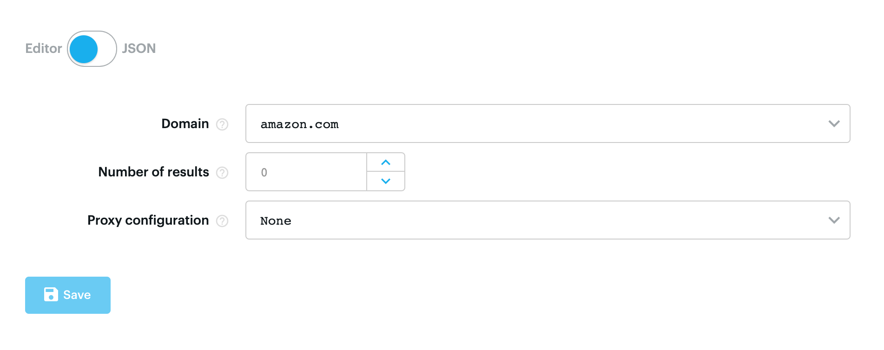
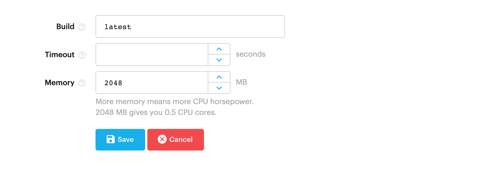
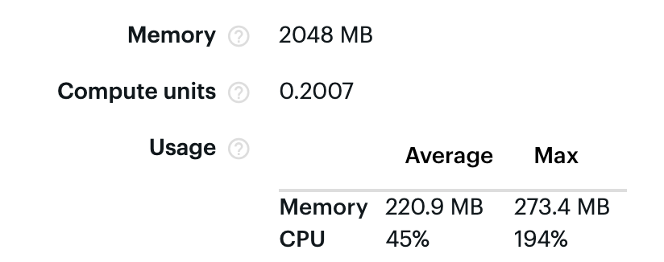

# Amazon Best Sellers Crawler

The actor crawls the Amazon Best Sellers categories and extracts the 100 top selling items. It extracts the item's name, price, URL, and its thumbnail image.

The actor can currently extract the .com, .co.uk, .de, .fr, .es, and .it domains.  If you would like to add support for another domain, please get in touch or edit the source code [yourself](https://github.com/m-murasovs/amazon-bestsellers-scraper).

## Sample result

```json
{
    "category": "Amazon.co.uk Best Sellers: The most popular items in Books",
    "categoryUrl": "https://www.amazon.co.uk/Best-Sellers-Books/zgbs/books/ref=zg_bs_nav_0/261-6986927-7102013",
    "items": {
        "0": {
            "name": "The Mirror and the Light (The Wolf Hall Trilogy)",
            "price": "£15.49",
            "url": "https://www.amazon.co.uk/Mirror-Light-Wolf-Hall-Trilogy/dp/0007480997/ref=zg_bs_books_1?_encoding=UTF8&psc=1&refRID=3PNZSWBH3A0H1QCWYPP6",
            "thumbnail": "https://images-eu.ssl-images-amazon.com/images/I/91-UvTTh4lL._AC_UL200_SR200,200_.jpg"
        },
    }
}
```
## Input



The actor is set to crawl [amazon.com](https://www.amazon.com/Best-Sellers/zgbs/) by default. Click on the drop-down menu if you would like to crawl another domain. Currently, the .co.uk, .de, .fr, .es, and .it domains are supported. 

To limit the number of results that are extracted, set the **Depth of crawl** value to the number of subcategories you would like to extract. 

Amazon Best Sellers includes 37 main categories. Several of these have another two levels of subcategorisation. Setting a crawl depth of 2 extracts 556 pages. A crawl depth of 3 extracts upward of 1600 pages.

## Proxy

For the actor to function properly, [proxies](https://docs.apify.com/proxy) are required. It is not recommended to run the actor on a free account for more than obtaining sample results. If you plan to run the actor for more than a few results, subscribe to the Apify platform and receive access to a large pool of proxies.

## Settings



Please ensure that Memory is set to at least **1024 MB** to ensure that the crawler has enough power to complete the task in a timely manner. If your machine allows, feel free to increase the memory allocation for more speed.

## During the run

During the run, the actor will output messages notifying you of which page is being extracted. When the items are extracted, the actor will notify you that they are being saved. 

Due to concurrent extraction of pages, these notifications may not be displayed in order.

The number of pending URLs is displayed throughout the run.

In case of an error, the actor will complete its run immediately, without adding any data to the dataset.

When it is finished, the actor will display a **Crawl complete.** message.

## CU usage

In a whole run which extracted all 37 category pages, the actor consumed 0.2007 Compute Units.



## Documentation reference

For more information on the Apify platform, Apify actors, and the Apify CLI, please consult the links below.

- [Apify SDK](https://sdk.apify.com/)
- [Apify Actor documentation](https://docs.apify.com/actor)
- [Apify CLI](https://docs.apify.com/cli)
